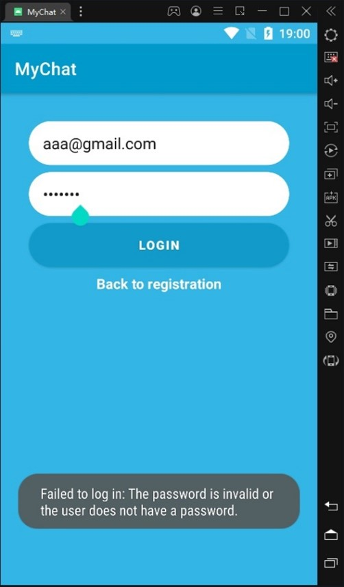
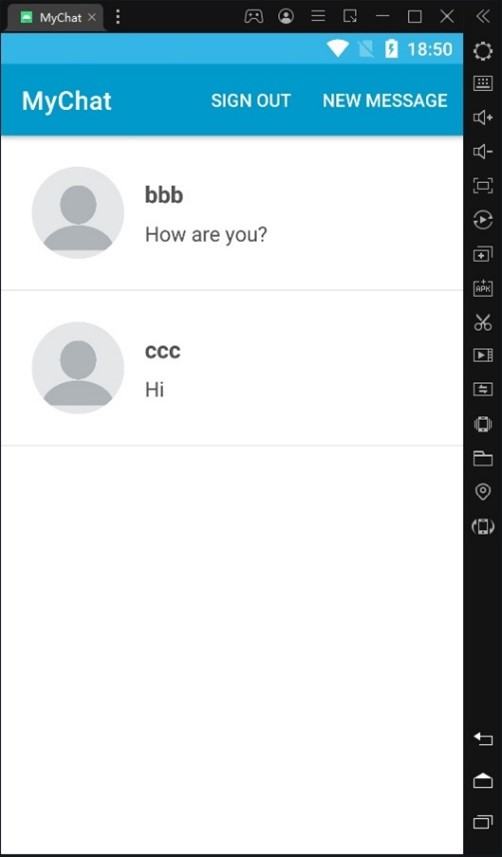

# android-encrypted-messaging
Encrypted chat for Android.

Приложение-мессенджер на языке Kotlin под ОС Android.
При подключении в разработанный протокол заложено установление сеансового ключа связи. Используется криптографическая библиотека Bouncy Castle, предоставляющая одноимённого криптопровайдера.ъ

Графический интерфейс приложения выполнен с использованием библиотек Groupie, Picasso. 

Окно регистрации пользователей выглядят следующим образом (на рисунках продемонстрированы ошибки ввода учетных данных для нового пользователя):

Так же есть возможность входа в существующий аккаунт (на рисунках продемонстрированы ошибки ввода учетных данных.:

Обмен сообщениями и список диалогов в приложении выглядят следующем образом:

Сообщения хранятся в базе данных Firebase в зашифрованном виде:

